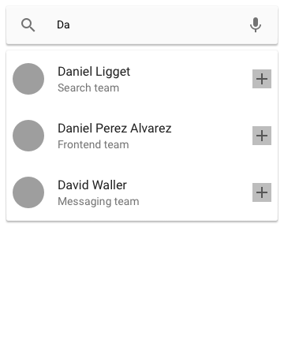
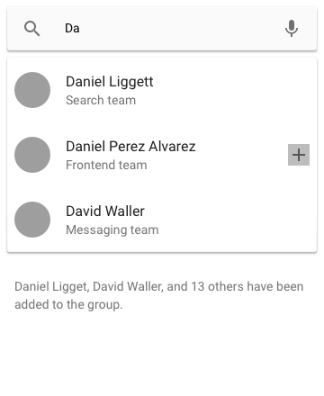

# Yammer's React-based interview exercise app

This app represents a simplified version of Yammer's group management feature. You have an input at the top where you can type. As the user types, you make requests to an API endpoint, and get results back, which you display to the user. The user can click on any of those results, and add them to a list of selected items.

The app starts out just with the search input:


As the user types, you get new results from the server:



When the user clicks on a result, it gets added to the list at the bottom:



## Setup

Run `npm install` at the root of the project.

## Running

Run `npm run start` at the root of the project to start both server and client parts of the app. If you just want to start the client part, run `npm run client` instead. Both will open <http://localhost:3000/> in your browser.

## Testing

Run `npm run test` at the root of the project.

## Hitting the API

Even though the server is listening on port 5000, we've configured things so that requests get proxied automatically, so you should only need to do something like:

```js
const response = await fetch("/api/search/John");
const data = await response.json();
```
